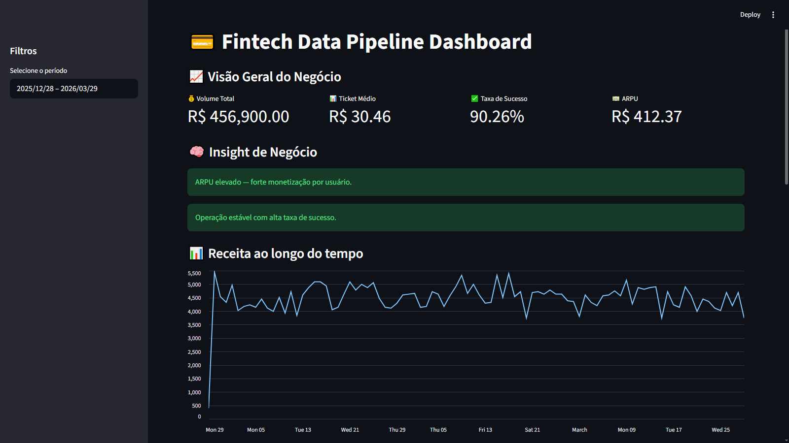
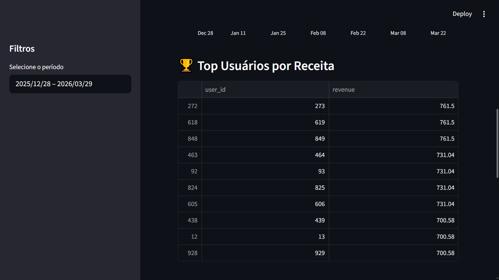
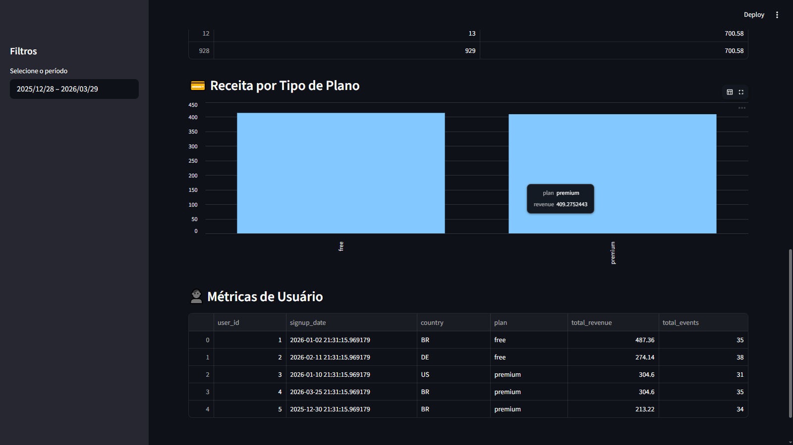

# Fintech Data Pipeline — Transaction & User Behavior Analytics (Análise de transações e comportamento do usuário)

## Overview (visão Geral)

Este projeto simula um ambiente real de uma fintech digital, com foco na construção de um pipeline de dados completo para análise de:

* Transações financeiras
* Comportamento de usuários
* Performance operacional
* Monetização

O pipeline transforma dados brutos em **métricas estratégicas prontas para tomada de decisão**.

---

## Business Problem (Problemática)

Uma fintech precisa responder:

* Quanto dinheiro está sendo movimentado diariamente?
* Qual a eficiência das transações?
* Usuários ativos geram mais receita?
* Existe relação entre comportamento e monetização?
* Como aumentar a receita por usuário (ARPU)?

---

## Solution (Solução)

Desenvolvimento de um pipeline ETL com:

* Ingestão de dados brutos (CSV)
* Validação e padronização (camada Silver)
* Processamento e geração de métricas (camada Gold)
* Persistência de dados analíticos
* Dashboard interativo para análise

---

## 🧱 Data Architecture (Medallion)

O projeto segue arquitetura em camadas:

### Bronze — Raw Data

📁 `data/raw/`

* Dados brutos
* Sem tratamento
* Fonte original

---

### Silver — Clean Data

📁 `data/silver/`

* Tipagem corrigida
* Dados validados
* Tratamento de qualidade
* Base confiável para transformação

---

### Gold — Analytics Layer

📁 `data/processed/`

* Dados agregados
* Métricas de negócio
* Prontos para BI

---

## Pipeline Flow (Fluxo)

Raw → Ingestion → **Silver (Clean)** → Transformation → **Gold (Metrics)** → Load → Dashboard

---

## Key Metrics (Métricas-Chave)

### Financial Metrics (Métricas Financeiras)

* Total Transaction Volume (Volume total de transações)
* Average Ticket (Ticket Médio)
* Success Rate (Taxa de Sucesso)

### User Metrics (Métricas do Usuário)

* Daily Active Users (DAU) - Usuários ativos diários (UAD)
* Events per User (Eventos por Usuário)

### Business Metrics

* Revenue per User (Receita por Usuário)
* ARPU (Average Revenue per User) - (Receita Média por Usuário)
* Engagement vs Monetization (Engajamento vs Monetização)

---

## 📁 Project Structure

```bash
fintech-data-pipeline/
│
├── data/
│   ├── raw/
│   ├── silver/
│   └── processed/
│
├── src/
│   ├── ingestion.py
│   ├── transformation.py
│   └── load.py
│
├── dashboards/
│   └── dashboard.py
│
├── logs/
├── main.py
├── requirements.txt
└── README.md
```

---

## 📤 Outputs

* daily_metrics.csv
* user_metrics.csv
* daily_active_users.csv
* events_per_user.csv
* **revenue_per_user.csv**

---

## 📊 Dashboard

O projeto inclui um dashboard interativo desenvolvido com Streamlit, apresentando:

* KPIs financeiros
* Métricas de monetização (ARPU)
* Receita ao longo do tempo
* Segmentação por plano
* Top usuários por receita

---

#### Overview


#### Métricas & Insights



## ▶️ How to Run

```bash
git clone https://github.com/frlucaslopes/fintech-data-pipeline.git
cd fintech-data-pipeline

pip install -r requirements.txt

# Executar pipeline
python main.py

# Executar dashboard
streamlit run dashboards/dashboard.py
```

---

## Sample Insights (Exemplos de Insights)

* Usuários premium geram maior receita média
* Alta taxa de sucesso (~90%) indica estabilidade operacional
* Usuários mais engajados tendem a gerar mais receita
* Existe oportunidade de aumento de ARPU

---

## Future Improvements (Melhorias Futuras)

* Integração com PostgreSQL
* Orquestração com Airflow
* Testes automatizados (Pytest)
* Data Quality Framework
* Deploy em cloud

---

## What This Project Demonstrates (O que este projeto demonstra)

-  Pipeline de dados end-to-end
- Arquitetura em camadas (Medallion)
- Processamento orientado a negócio
- Modelagem de métricas reais
- Integração com camada de visualização

---

## 👨‍💻 Author

Lucas M. Lopes - Data Engineer (Engenheiro de Dados)

---

## 📄 License

Projeto para fins educacionais e portfólio.
